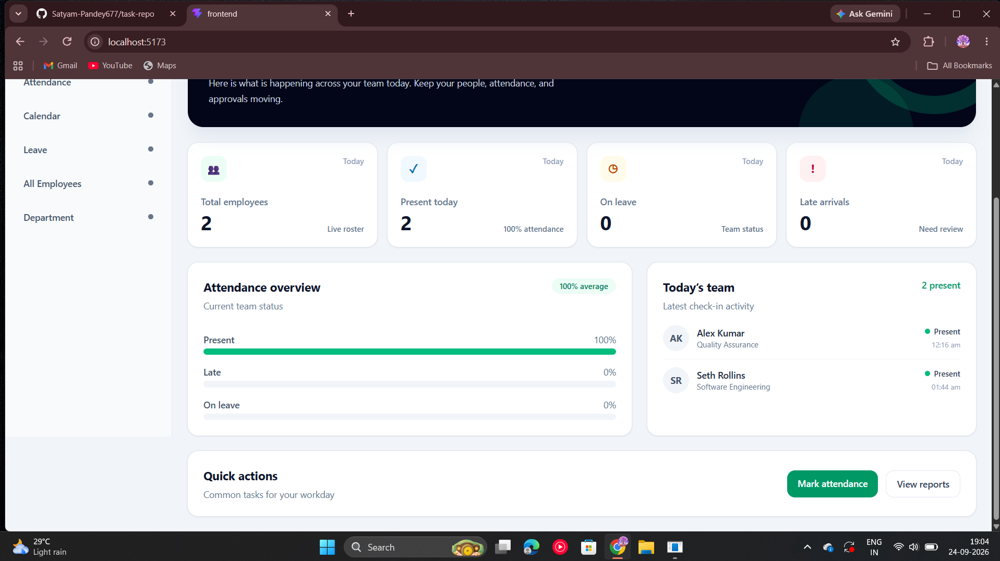
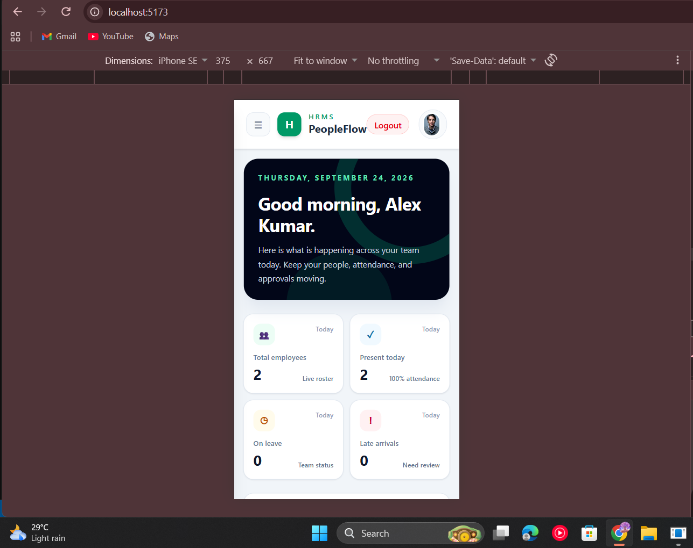
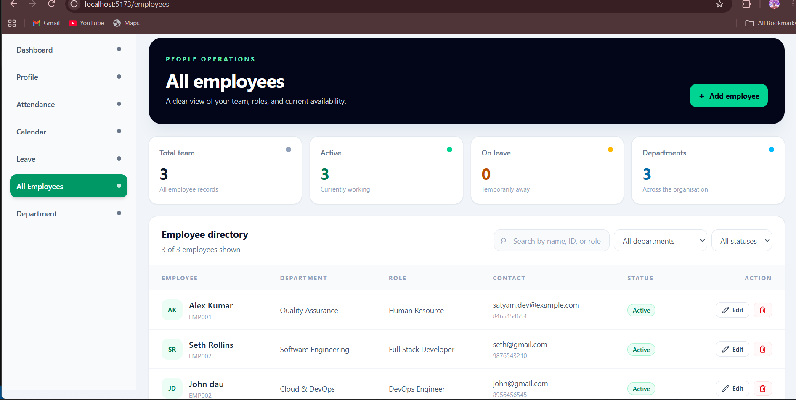
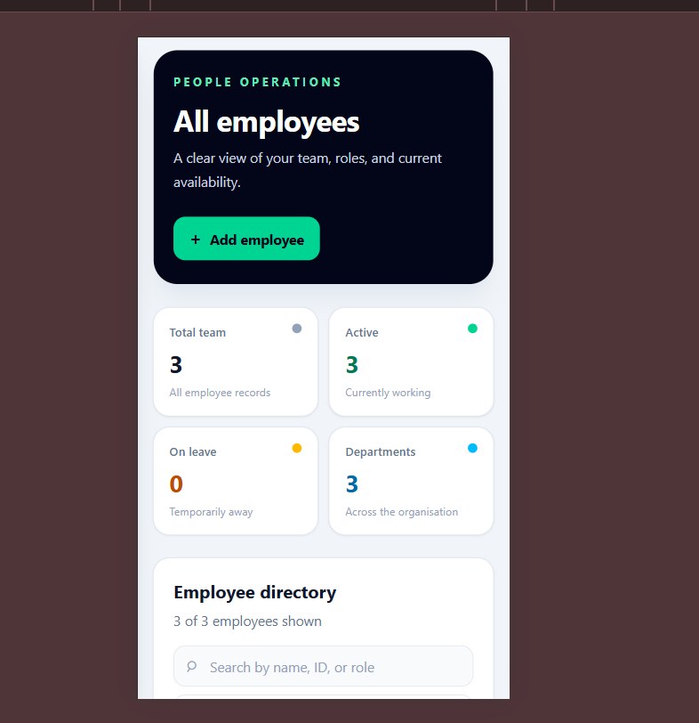
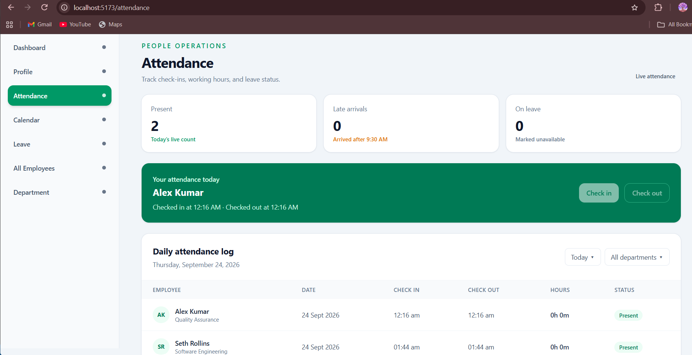
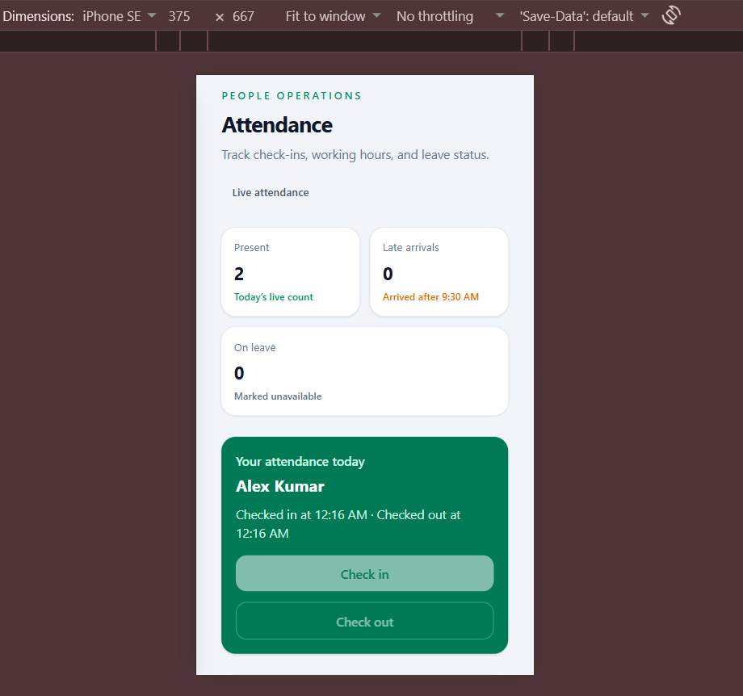

# Human Resource Management System (HRMS) - PeopleFlow

[](https://github.com/Satyam-Pandey677/task-repo)
[](https://vitejs.dev/)
[](https://tailwindcss.com/)

A modern, full-stack **Human Resource Management System (HRMS)** built for **Screenista Private Limited** technical evaluation assignment using the **MERN Stack**. 

The system provides complete employee lifecycle management, role-based access control (Admin/HR vs. Employee), real-time attendance check-in/out tracking, monthly attendance calendars, leave request management, department management, and a mobile & desktop responsive UI.

---

## 🌟 Key Features

### 🔐 1. Authentication & Security
- **Role-Based Access Control (RBAC):** Admin/HR vs. Employee dashboard views and route protection.
- **JWT Authentication:** Secure token-based session management using Http/Bearer authorization headers.
- **Password Management:** Secure password hashing with `bcrypt` and password update capabilities.

### 👥 2. Employee Management
- **Employee Lifecycle CRUD:** Add, edit, view details, and soft/hard delete employee records.
- **Automatic Employee ID Generation:** Auto-generates unique IDs (e.g., `EMP-1001`).
- **Profile Customization:** Employees can update self-profile details; Admins can manage role, designation, status, and salary.

### ⏱️ 3. Attendance Management
- **Real-Time Check-In & Check-Out:** Single-click daily attendance marking with automatic late calculation.
- **Attendance Statistics:** Monthly present days, working days, and attendance percentage tracking.
- **Monthly Attendance Calendar:** Interactive visual calendar displaying daily attendance status and approved leaves.

### 🌴 4. Leave Management
- **Leave Application:** Employees can submit leave requests with start date, end date, and reason.
- **Leave Approval Workflow:** Admins can review, approve, or reject pending leave requests.

### 🏢 5. Department Management
- **Department Setup:** Admin CRUD operations for organizing employees into departments.

---

## 🛠️ Technology Stack

| Layer | Technology |
| :--- | :--- |
| **Frontend** | React 19, Vite, Tailwind CSS v4, Lucide React Icons, React Router v7, Axios |
| **Backend** | Node.js, Express.js (ES Modules) |
| **Database** | MongoDB (Mongoose ODM) |
| **Authentication** | JSON Web Tokens (JWT), Bcrypt Password Hashing |
| **Responsiveness** | Mobile & Desktop Responsive Layout with Mobile Drawer Navigation |

---

## 📁 Repository Structure

```text
HRMS/
├── backend/
│   ├── src/
│   │   ├── config/          # MongoDB connection logic
│   │   ├── controller/      # User, Employee, Attendance, Leave & Department controllers
│   │   ├── middelware/      # Authentication & Role authorization middleware
│   │   ├── model/           # Mongoose schemas (User, Employee, Attendance, Leave, Department)
│   │   ├── router/          # Express route definitions
│   │   └── utils/           # Helper functions (ID generation, etc.)
│   ├── .env.example         # Backend environment variable template
│   └── package.json
├── frontend/
│   ├── src/
│   │   ├── Components/      # Navbar, Sidebar, Form cards & loaders
│   │   ├── context/         # Auth & App state management Context
│   │   ├── pages/           # Dashboard, Attendance, Leave, Profile, Admin management pages
│   │   ├── App.jsx          # Router & layout wiring
│   │   └── main.jsx
│   ├── .env.example         # Frontend environment variable template
│   ├── vite.config.js       # Vite configuration with API proxying
│   └── package.json
├── API_DOCUMENTATION.md     # Detailed REST API Documentation
└── README.md                # Project documentation & setup guide
```

---

## 🚀 Setup & Installation Instructions

### Prerequisites
- **Node.js** (v18.0.0 or higher recommended)
- **npm** (v9.0.0 or higher)
- **MongoDB** (Local instance or MongoDB Atlas cluster connection string)

---

### Step 1: Clone the Repository
```bash
git clone https://github.com/Satyam-Pandey677/task-repo.git
cd task-repo
```

---

### Step 2: Backend Setup

1. Navigate to the backend directory:
   ```bash
   cd backend
   ```

2. Install dependencies:
   ```bash
   npm install
   ```

3. Configure environment variables:
   Copy `.env.example` to `.env`:
   ```bash
   cp .env.example .env
   ```
   Fill in your configuration in `.env`:
   ```env
   PORT=8000
   MONGODB_KEY=mongodb+srv://<username>:<password>@cluster.mongodb.net
   JWT_SECRET=your_secret_jwt_key_here
   ```

4. Start the backend development server:
   ```bash
   npm run dev
   ```
   The backend server will run on `http://localhost:8000`.

---

### Step 3: Frontend Setup

1. Open a new terminal window and navigate to the frontend directory:
   ```bash
   cd frontend
   ```

2. Install dependencies:
   ```bash
   npm install
   ```

3. Configure environment variables (Optional):
   Copy `.env.example` to `.env`:
   ```bash
   cp .env.example .env
   ```

4. Start the frontend development server:
   ```bash
   npm run dev
   ```
   The frontend application will run on `http://localhost:5173`.

---

## 📖 API Documentation

Detailed REST API documentation covering request schemas, authentication headers, query parameters, and JSON response samples is available in [API_DOCUMENTATION.md](./API_DOCUMENTATION.md).

---

## 📱 Mobile & Desktop Responsiveness Showcase

The HRMS application is designed to provide an optimized experience across all screen sizes:

### 💻 Desktop View
- Full persistent sidebar navigation.
- Comprehensive data tables for employee rosters, attendance history, and department lists.
- Interactive monthly calendar grid.

### 📱 Mobile View
- Slide-out mobile drawer navigation accessible via hamburger menu (`☰`).
- Touch-friendly action buttons and responsive cards for attendance check-in/out and profile view.
- Overflow scrolling support for data tables.

## Screen Shots

<div align="center">

<h3>Dashboard</h3>



<br><br>



<br><br>

<h3>Employee Management</h3>



<br><br>



<br><br>

<h3>Attendance Management</h3>



<br><br>



</div>

---

## 📝 Submission Deliverables Checklist

- [x] Complete MERN stack source code uploaded to GitHub repository
- [x] README with setup and installation instructions
- [x] Backend `.env.example` & Frontend `.env.example` included
- [x] Comprehensive `API_DOCUMENTATION.md` file included
- [x] Authentication, Employee Management, Attendance & Leave APIs functional
- [x] Mobile and Desktop responsive UI integrated with backend APIs

---

## 👨‍💻 Developer Information

**Submitted by:** Satyam Pandey  
**Position:** MERN Stack Developer  
**Company:** Screenista Private Limited Assignment Submission  

---
